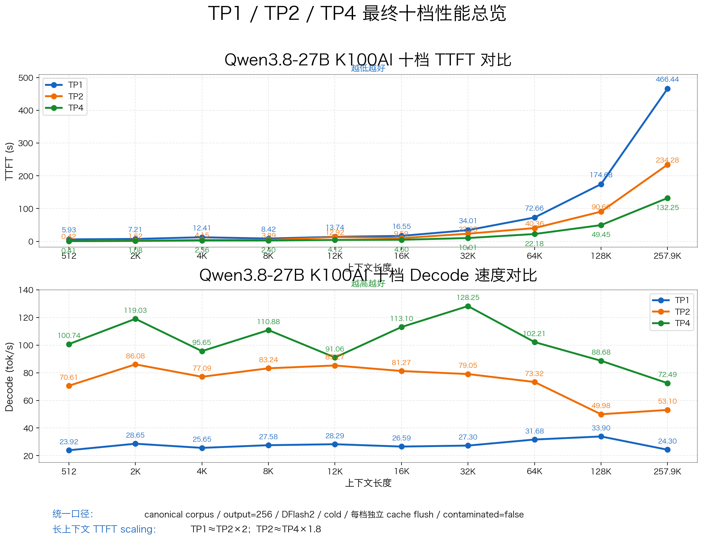
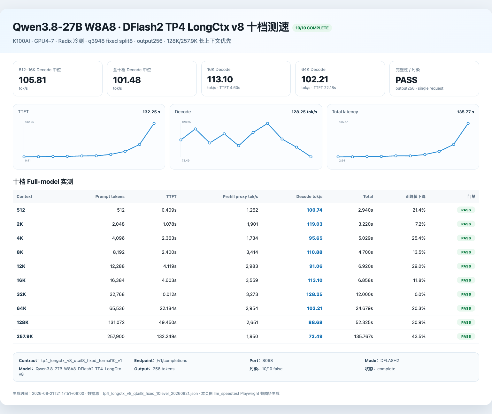

# Qwen3.8-27B INT8/W8A8 on K100AI

> **SGLang performance optimization for Hygon K100AI**
> TP1 / TP2 / TP4 · DFlash2 · Agent long context · gfx928 native kernels

> ⚠️ **免责声明 / 风险提示**
>
> 本项目是社区研究成果，不是海光、SourceFind、Qwen、SGLang 或 DFlash2 官方发行版。项目依赖宿主机已经正常工作的 K100AI 驱动、DTK/hyhal、Docker 与 GPU 设备映射。错误的 GPU/PCIe/驱动操作可能导致现有业务中断，极端情况下需要重启服务器恢复。
>
> **本仓库不会自动安装、替换或重新编译宿主机 `amdgpu.ko` / DKMS 驱动，也不会自动修改 GRUB、IOMMU、ACS 或执行 `setpci`。** 如果 `hy-smi`、`/dev/kfd`、`/opt/hyhal` 或官方 SourceFind 容器本身不正常，请先停止部署，不要让本项目替你"修驱动"。

## 这是什么

这是一个面向 **Hygon K100AI / gfx928** 的 Qwen3.8-27B **INT8/W8A8 推理优化总项目**。

仓库不再把某一个并行度或某一种投机算法写进项目名称。TP1、TP2、TP4、DFlash2、长上下文 prefill、native INT8 kernel 都是同一个优化栈里的不同 profile / 技术组件。

当前主要目标是：

- 在 K100AI 上稳定运行 Qwen3.8-27B SmoothQuant W8A8；
- 针对真实 Agent 的 32K–128K 长上下文优化 TTFT 与 decode；
- 提供 TP1 / TP2 / TP4 三种可复现配置；
- DFlash2 投机解码、Radix Cache、gfx928 native kernel 与 correctness 修复统一维护；
- 所有正式性能结果必须通过固定 prompt、output256、无污染、quality/correctness 门禁。

---

## 先选你的 Profile

| Profile | GPU | 正式验收范围 | 代表性能 | 适合谁 | 状态 |
|---|---:|---:|---|---|---|
| **[TP1](TP1.md)** | 1× K100AI | 512 → 257.9K | 64K **72.66s / 31.68 tok/s** · 128K **174.68s / 33.90** · 257.9K **466.44s / 24.30** | GPU 最省、单用户 Agent | **ACCEPTED** |
| **[TP2](TP2.md)** | 2× K100AI | 512 → 257.9K | 64K **40.36s / 73.32 tok/s** · 128K **90.66s / 49.98** · 257.9K **234.28s / 53.10** | 性能 / GPU 成本平衡 | **ACCEPTED** |
| **[TP4](TP4.md)** | 4× K100AI | 512 → 257.9K | 64K **22.18s / 102.21 tok/s** · 128K **49.45s / 88.68** · 257.9K **132.25s / 72.49** | 长上下文、高 decode、长期主服务 | **CHAMPION** |

> 三个 Profile 使用同一套 target / draft、同一测试语料和 output256 口径。选择时优先看相同上下文下的 TTFT / decode，再结合 GPU 成本。

### TP1 / TP2 / TP4 正式十档

统一口径：**canonical corpus / output=256 / DFlash2 / cold / 每档独立 cache flush / contaminated=false**。

| 上下文 | TP1 TTFT | TP1 Decode | TP2 TTFT | TP2 Decode | TP4 TTFT | TP4 Decode |
|---:|---:|---:|---:|---:|---:|---:|
| 512 | 5.93s | 23.92 | 0.42s | 70.61 | 0.41s | 100.74 |
| 2K | 7.21s | 28.65 | 1.62s | 86.08 | 1.08s | 119.03 |
| 4K | 12.41s | 25.65 | 4.15s | 77.09 | 2.36s | 95.65 |
| 8K | 8.42s | 27.58 | 3.89s | 83.24 | 2.40s | 110.88 |
| 12K | 13.74s | 28.29 | 12.92s | 85.27 | 4.12s | 91.06 |
| 16K | 16.55s | 26.59 | 9.59s | 81.27 | 4.60s | 113.10 |
| 32K | 34.01s | 27.30 | 23.23s | 79.05 | 10.01s | 128.25 |
| 64K | 72.66s | 31.68 | 40.36s | 73.32 | 22.18s | 102.21 |
| 128K | 174.68s | 33.90 | 90.66s | 49.98 | 49.45s | 88.68 |
| 257.9K | 466.44s | 24.30 | 234.28s | 53.10 | 132.25s | 72.49 |



完整 Total、scaling 与质量门见 **[PERFORMANCE.md](PERFORMANCE.md)**。机器可读统一数据：`results/tp1_tp2_tp4_10level_20260823.json`。

---

## 从零部署：先选一种方式（三选一）

当前部署/复现正式版：**v1.1.1（2026-08-23）**。它沿用 v1.1.0 已验收的推理 runtime、模型与 `unified-20260823` 完整镜像，只修复部署教程和构建辅助脚本；性能数据不变。一个运行时同时支持 `PROFILE=tp1|tp2|tp4`。

> **A / B / C 是三种互斥的部署方式，不是连续步骤。只选一种。** 另外，模型权重只准备一套；夸克整合包和 HuggingFace 也是二选一，不要重复下载。

| 方式 | 适合谁 | 需要下载 | 是否 build |
|---|---|---|---|
| **A. 完整成品镜像** | 第一次部署、最省事 | `unified-20260823` 完整镜像 + 一套模型权重 | 否 |
| **B. 官方镜像 + 补丁构建** | 已有 SourceFind 基础镜像、想减少传输 | SourceFind 基础镜像 + `v1.1.1` 仓库 + 一套模型权重 | 是，使用预编译 `.so` |
| **C. 全源码构建** | 需要审计/修改 HIP kernel | SourceFind 基础镜像 + `v1.1.1` 仓库 + 一套模型权重 | 是，并重编 7 个 `.so` |

### 0. 所有方式先做宿主机检查

下面命令都应在 **K100AI 算力服务器宿主机**执行：

```bash
hy-smi

test -e /dev/kfd && echo '/dev/kfd: OK' || echo '/dev/kfd: MISSING'
test -d /opt/hyhal && echo '/opt/hyhal: OK' || echo '/opt/hyhal: MISSING'

ls -l /dev/dri/renderD*
docker version
```

至少确认：

- `hy-smi` 能正常看到准备使用的 K100AI；
- `/dev/kfd` 存在；
- `/opt/hyhal` 存在；
- 你已经确认目标 GPU 对应的 `renderD*`；
- Docker 正常工作。

如果使用 `.tar.zst` 完整镜像或夸克权重包，还需要：

```bash
command -v zstd
```

如果上述基础环境本身不正常，请先停止。**本项目不会替你安装/覆盖宿主机 GPU 驱动，也不会自动修改 GRUB、IOMMU、ACS 或执行 `setpci`。**

---

## 1. 所有方式共用：准备模型权重（二选一下载源）

最终运行始终需要两份模型：

| 角色 | HuggingFace repo | 固定 revision |
|---|---|---|
| W8A8 Target | `Freaksterz/Qwen3.8-27B-SmoothQuant-W8A8-INT8` | `417ede1e4524c8fdbb586ebdabc9cfc5d0760b3e` |
| DFlash2 Draft | `z-lab/Qwen3.8-27B-DFlash2` | `50307d4c4cde6860d4eee73e2547cd786fe8e8a4` |

**不需要 Qwen3.8 BF16/FP16 Base 权重。**

### 下载源 1：夸克整合权重包

- 文件夹：`Qwen3.8-K100AI-Weights-20260823`
- 下载：**[夸克网盘](https://pan.quark.cn/s/eb79a87216ba?pwd=Rcxc)**
- 提取码：`Rcxc`
- 压缩包：`qwen38-k100ai-w8a8-dflash2-weights-20260823.tar.zst`
- SHA256：`aa33b9d1ed1e31b1f5c3c6989a302299ecb957ff3f2768f233fdaab17f0073f5`

下载到算力服务器后：

```bash
ARCHIVE=qwen38-k100ai-w8a8-dflash2-weights-20260823.tar.zst

echo "aa33b9d1ed1e31b1f5c3c6989a302299ecb957ff3f2768f233fdaab17f0073f5  $ARCHIVE" | sha256sum -c -
zstd -t "$ARCHIVE"

mkdir -p "$HOME/models/q38-release"
zstd -dc "$ARCHIVE" | tar -xf - -C "$HOME/models/q38-release"

export WEIGHTS_ROOT="$HOME/models/q38-release/Qwen3.8-27B-K100AI-W8A8-DFlash2-Weights-20260823"
export TARGET_MODEL="$WEIGHTS_ROOT/target/Qwen3.8-27B-SmoothQuant-W8A8-INT8"
export DRAFT_MODEL="$WEIGHTS_ROOT/draft/Qwen3.8-27B-DFlash2"
```

**注意真实目录层级就是上面这两条路径。** 整合包不是解压后直接得到 `/target` 和 `/draft`。

下载这个整合包后，**不要再执行下面的 HuggingFace 下载。**

### 下载源 2：HuggingFace

国内网络可使用群友实测可用的 HF Mirror：

```bash
python3 -m pip install -U huggingface_hub

export HF_ENDPOINT=https://hf-mirror.com
export HF_HUB_DISABLE_XET=1

MODEL_ROOT="$HOME/models"
mkdir -p "$MODEL_ROOT"

hf download Freaksterz/Qwen3.8-27B-SmoothQuant-W8A8-INT8 \
  --revision 417ede1e4524c8fdbb586ebdabc9cfc5d0760b3e \
  --local-dir "$MODEL_ROOT/Qwen3.8-27B-SmoothQuant-W8A8-INT8"

hf download z-lab/Qwen3.8-27B-DFlash2 \
  --revision 50307d4c4cde6860d4eee73e2547cd786fe8e8a4 \
  --local-dir "$MODEL_ROOT/Qwen3.8-27B-DFlash2"

export TARGET_MODEL="$MODEL_ROOT/Qwen3.8-27B-SmoothQuant-W8A8-INT8"
export DRAFT_MODEL="$MODEL_ROOT/Qwen3.8-27B-DFlash2"
```

如果机器能直接访问 HuggingFace，去掉两行 `export HF_*` 即可。这里两条 `hf download` 是**同一个 HuggingFace 方案内必须准备的 Target + Draft**，不是两个下载方案。

### 模型文件自检

无论选择哪个下载源，都先执行：

```bash
printf 'TARGET_MODEL=%s\nDRAFT_MODEL=%s\n' "$TARGET_MODEL" "$DRAFT_MODEL"

test -s "$TARGET_MODEL/config.json"
test -s "$TARGET_MODEL/tokenizer.json"
test -s "$TARGET_MODEL/model.safetensors.index.json"
test -s "$TARGET_MODEL/model-mtp.safetensors"
test -s "$DRAFT_MODEL/config.json"
test -s "$DRAFT_MODEL/model.safetensors"

echo 'model files: OK'
```

如果你重新登录了 shell，记得重新设置 `TARGET_MODEL` 和 `DRAFT_MODEL`，或者在后面的 `.env` 中写绝对路径。

---

## 2A. 方式 A：完整成品镜像（推荐）

**A 不需要 clone GitHub 仓库，也不需要执行任何 build。** 启动脚本已经在镜像里面。

### A1. 下载并校验完整镜像

- 文件：`qwen38-k100ai-int8-unified-20260823.docker.tar.zst`
- 压缩大小：**5.65 GiB（6,065,184,632 bytes）**
- Docker image `.Size`：**31,699,585,312 bytes（约 31.70 GB）**
- Docker tag：`qwen38-k100ai-int8:unified-20260823`
- SHA256：`6d14588722b0fea0ab66a53e2810385d1f9999a9cd78c8e1d2e6640c744f2b14`
- 下载：**[夸克网盘：full_images](https://pan.quark.cn/s/e7626123faa0?pwd=M8Fr)** · 提取码：`M8Fr`

```bash
IMAGE_ARCHIVE=qwen38-k100ai-int8-unified-20260823.docker.tar.zst

echo "6d14588722b0fea0ab66a53e2810385d1f9999a9cd78c8e1d2e6640c744f2b14  $IMAGE_ARCHIVE" | sha256sum -c -
zstd -t "$IMAGE_ARCHIVE"
zstd -dc "$IMAGE_ARCHIVE" | docker load

docker image inspect qwen38-k100ai-int8:unified-20260823 >/dev/null
echo 'image: OK'
```

### A2. 启动脚本在哪里

完整镜像已经固定：

```text
Docker ENTRYPOINT
└─ /opt/qwen38-k100ai/start.sh
   ├─ PROFILE=tp1 → /opt/qwen38-k100ai/entrypoint.tp1.sh
   ├─ PROFILE=tp2 → /opt/qwen38-k100ai/entrypoint.tp2.sh
   └─ PROFILE=tp4 → /opt/qwen38-k100ai/entrypoint.tp4.sh
```

你**不需要手工进入容器执行这些脚本**。下面的 `docker run ... qwen38-k100ai-int8:unified-20260823` 会自动触发 Docker ENTRYPOINT；你只需要设置 `PROFILE`、GPU 设备、模型挂载和端口。

如需核对镜像内部脚本：

```bash
docker run --rm --entrypoint /bin/bash qwen38-k100ai-int8:unified-20260823 -lc \
  'ls -l /opt/qwen38-k100ai/start.sh /opt/qwen38-k100ai/entrypoint.tp1.sh /opt/qwen38-k100ai/entrypoint.tp2.sh /opt/qwen38-k100ai/entrypoint.tp4.sh'
```

### A3. 选择 Profile 并启动

先把 `renderDXXX` 换成你在第 0 步确认的真实设备号。

**TP1：**

```bash
export R0=/dev/dri/renderDXXX

docker run -d \
  --name qwen38-tp1 \
  --network host --ipc host \
  --restart unless-stopped \
  --security-opt label=disable \
  --device /dev/kfd:/dev/kfd \
  --device "$R0:$R0" \
  -v /opt/hyhal:/opt/hyhal:ro \
  -v "$TARGET_MODEL:/models/target:ro" \
  -v "$DRAFT_MODEL:/models/draft:ro" \
  -e PROFILE=tp1 \
  -e HIP_VISIBLE_DEVICES=0 \
  -e PORT=8090 \
  qwen38-k100ai-int8:unified-20260823
```

**TP2：**

```bash
export R0=/dev/dri/renderDXXX
export R1=/dev/dri/renderDXXX

docker run -d \
  --name qwen38-tp2 \
  --network host --ipc host \
  --restart unless-stopped \
  --security-opt label=disable \
  --device /dev/kfd:/dev/kfd \
  --device "$R0:$R0" \
  --device "$R1:$R1" \
  -v /opt/hyhal:/opt/hyhal:ro \
  -v "$TARGET_MODEL:/models/target:ro" \
  -v "$DRAFT_MODEL:/models/draft:ro" \
  -e PROFILE=tp2 \
  -e HIP_VISIBLE_DEVICES=0,1 \
  -e PORT=8062 \
  -e CUSTOM_AR=1 \
  -e P2P=1 \
  qwen38-k100ai-int8:unified-20260823
```

**TP4：**

```bash
export R0=/dev/dri/renderDXXX
export R1=/dev/dri/renderDXXX
export R2=/dev/dri/renderDXXX
export R3=/dev/dri/renderDXXX

docker run -d \
  --name qwen38-tp4 \
  --network host --ipc host \
  --restart unless-stopped \
  --security-opt label=disable \
  --device /dev/kfd:/dev/kfd \
  --device "$R0:$R0" \
  --device "$R1:$R1" \
  --device "$R2:$R2" \
  --device "$R3:$R3" \
  -v /opt/hyhal:/opt/hyhal:ro \
  -v "$TARGET_MODEL:/models/target:ro" \
  -v "$DRAFT_MODEL:/models/draft:ro" \
  -e PROFILE=tp4 \
  -e HIP_VISIBLE_DEVICES=0,1,2,3 \
  -e PORT=8068 \
  -e CUSTOM_AR=1 \
  qwen38-k100ai-int8:unified-20260823
```

### A4. 验证

| Profile | 容器名 | 端口 | served model name |
|---|---|---:|---|
| TP1 | `qwen38-tp1` | 8090 | `Qwen3.8-27B-W8A8-DFlash2-TP1` |
| TP2 | `qwen38-tp2` | 8062 | `Qwen3.8-27B-W8A8-DFlash2-TP2` |
| TP4 | `qwen38-tp4` | 8068 | `Qwen3.8-27B-W8A8-DFlash2-TP4` |

以 TP4 为例：

```bash
CONTAINER=qwen38-tp4
PORT=8068
SERVED_MODEL=Qwen3.8-27B-W8A8-DFlash2-TP4

docker logs --tail=100 "$CONTAINER"
curl -fsS "http://127.0.0.1:$PORT/health"
curl -fsS "http://127.0.0.1:$PORT/v1/models"

curl -fsS "http://127.0.0.1:$PORT/v1/chat/completions" \
  -H 'Content-Type: application/json' \
  -d "{\"model\":\"$SERVED_MODEL\",\"messages\":[{\"role\":\"user\",\"content\":\"你好\"}],\"max_tokens\":32,\"temperature\":0}"
```

TP1 / TP2 只需按上表替换 `CONTAINER`、`PORT`、`SERVED_MODEL`。

---

## 2B. 方式 B：SourceFind 官方镜像 + 补丁构建

B 会使用仓库里已经验证的 7 个预编译 gfx928 用户态 HIP `.so`，**不会重编宿主机驱动**。

### B1. 拉取固定 SourceFind 基础镜像

```bash
BASE_IMAGE='harbor.sourcefind.cn:5443/dcu/admin/base/custom@sha256:366525b25f452f85eb0ea5813604a64f03c648627bc824bb498b56cf5a325dde'

docker pull "$BASE_IMAGE"
docker image inspect "$BASE_IMAGE" >/dev/null
```

该 digest 对应项目验收使用的 SourceFind SGLang 0.5.12 / DTK 26.04 基础镜像。Harbor 访问权限由厂商侧决定；无法 pull 时，请从海光/SourceFind 正常渠道取得同一镜像。

### B2. 获取固定 `v1.1.1` 仓库

```bash
git clone --branch v1.1.1 --depth 1 https://github.com/DocPang/qwen38-k100ai-int8-optimization.git
cd qwen38-k100ai-int8-optimization

git describe --tags --exact-match
# 应输出: v1.1.1
```

`v1.1.1` 的推理 runtime、patchset 和 7 个预编译 `.so` 与 v1.1.0 已验收版本相同；本次 patch 只修复部署可复现性和构建辅助脚本。

### B3. 配置 `.env`

仓库根目录已经提供：

```text
.env.example
build_image.sh
build_native.sh
run.sh
Dockerfile
```

执行：

```bash
cp .env.example .env
```

然后编辑 `.env`。以 TP4 为例：

```dotenv
PROFILE=tp4

TARGET_MODEL=/绝对路径/Qwen3.8-27B-SmoothQuant-W8A8-INT8
DRAFT_MODEL=/绝对路径/Qwen3.8-27B-DFlash2

RENDER0=/dev/dri/renderDXXX
RENDER1=/dev/dri/renderDXXX
RENDER2=/dev/dri/renderDXXX
RENDER3=/dev/dri/renderDXXX

PORT=
IMAGE_TAG=qwen38-k100ai-int8-series:local
CUSTOM_AR=1
P2P=1
```

这里的 `TARGET_MODEL` / `DRAFT_MODEL` 填第 1 节已经验证过的**宿主机绝对路径**。TP1 只使用 `RENDER0`；TP2 只使用 `RENDER0-1`；TP4 使用 `RENDER0-3`。

在线构建时不用写 `BASE_IMAGE`，`build_image.sh` 默认就是上面的固定 digest。离线构建见 [TP4_OFFLINE_DEPLOY.md](TP4_OFFLINE_DEPLOY.md)。

### B4. 构建薄优化镜像

```bash
bash build_image.sh
```

该脚本会：

1. 校验 `native_ext/PREBUILT_SHA256SUMS` 中的 7 个预编译 `.so`；
2. 使用固定 SourceFind 基础镜像；
3. 将 `qwen38-k100ai-patchset.tar.gz` 安装进镜像；
4. 生成 `qwen38-k100ai-int8-series:local`。

检查：

```bash
docker image inspect qwen38-k100ai-int8-series:local >/dev/null
echo 'built image: OK'
```

### B5. 启动

**B/C 的正确宿主机启动入口是仓库根目录的 `run.sh`，不是方式 A 那条写死 `unified-20260823` 的 `docker run`。**

```bash
bash run.sh
```

`run.sh` 会先检查模型目录、`/dev/kfd`、`/opt/hyhal`、所需 `renderD*`、镜像 tag 和同名容器，再生成并执行 `docker run`。任何必需项缺失都会直接退出。

默认容器名和端口：

| `PROFILE` | 容器名 | 端口 |
|---|---|---:|
| `tp1` | `qwen38-tp1` | 8090 |
| `tp2` | `qwen38-tp2` | 8062 |
| `tp4` | `qwen38-tp4` | 8068 |

启动后按 A4 的方法验证。

---

## 2C. 方式 C：全源码构建

C 与 B 使用同一份 `v1.1.1` 仓库、同一份模型和同一个 `run.sh`；**唯一核心差异是 7 个 native HIP 扩展会从源码重新编译。**

先完成 B1、B2、B3，然后执行：

```bash
REBUILD_NATIVE=1 bash build_image.sh
```

源码构建链：

```text
build_image.sh
└─ build_native.sh
   └─ 无 GPU / 无网络 / 非 privileged 临时容器
      └─ native_ext/build_native.py
         └─ 生成 7 个 .so 到 .build/native/
```

`build_native.sh` 只读挂载宿主机 `/opt/hyhal`，不会映射 `/dev/kfd` 或 `renderD*`，也不会修改宿主机驱动。

构建成功后仍然是：

```bash
bash run.sh
```

然后按 A4 验证。

> 离线 C 路线建议显式执行：`BASE_IMAGE=qwen38-sourcefind-base:20260620 REBUILD_NATIVE=1 bash build_image.sh`。v1.1.1 的 `build_image.sh` 也会把从 `.env` 解析出的 `BASE_IMAGE` 继续传给 `build_native.sh`，显式写法则最容易审计。

---

## 3. 启动脚本到底在哪里

这是 v1.1.1 部署包对应的完整调用链；镜像内推理 runtime 沿用 v1.1.0 已验收 payload：

```text
方式 A：
宿主机 docker run
└─ 镜像 ENTRYPOINT: /opt/qwen38-k100ai/start.sh
   ├─ tp1 -> /opt/qwen38-k100ai/entrypoint.tp1.sh
   ├─ tp2 -> /opt/qwen38-k100ai/entrypoint.tp2.sh
   └─ tp4 -> /opt/qwen38-k100ai/entrypoint.tp4.sh

方式 B / C：
宿主机仓库根目录 ./run.sh
└─ docker run qwen38-k100ai-int8-series:local
   └─ 镜像 ENTRYPOINT: /opt/qwen38-k100ai/start.sh
      └─ 对应 /opt/qwen38-k100ai/entrypoint.tp*.sh
```

仓库中可直接审计的对应源码：

```text
full_images/entrypoint.sh
full_images/entrypoint_tp1.sh
full_images/entrypoint_tp2.sh
full_images/entrypoint_tp4.sh
```

构建 B/C 时，`qwen38-k100ai-patchset.tar.gz` 中的 `profile_runtime/start.sh` 和 `profile_runtime/entrypoint.tp*.sh` 会被安装到 `/opt/qwen38-k100ai/`。发布前已核对：patchset 内 TP1/TP2/TP4 entrypoint 与仓库 `full_images/entrypoint_tp*.sh` 一致。

### 最终是不是原生 SGLang？

是。最终 server 仍然是固定 SourceFind SGLang 0.5.12 的标准 `sglang.launch_server` / `run_server()`。

正式镜像在它前面保留了一个很薄的 fail-closed 门禁：

```text
/data/qwen38-27b-k100ai-int8-opt/scripts/launch_sglang_require_sitecustomize.py
```

它只强制确认本项目的 `sitecustomize` runtime patch 已成功加载；失败就终止，避免 Python 默认的 fail-open 行为悄悄启动 stock SGLang。补丁加载成功后，它调用标准 `sglang.launch_server`，不自定义参数解析或 server 实现。

<details>
<summary><strong>高级排障：查看原生 <code>sglang serve</code> 参数主体</strong></summary>

> 这部分**不是第一次部署的必做步骤**。单独复制 `sglang serve` 到裸上游环境不会自动加载本项目的 runtime patch、Triton cache 和 native `.so`；完整固定环境变量请看上面的 `full_images/entrypoint_tp*.sh`。

TP1：

```bash
sglang serve \
  --model-path /tmp/q38-target-model \
  --host 0.0.0.0 --port 8090 --random-seed 0 \
  --served-model-name Qwen3.8-27B-W8A8-DFlash2-TP1 \
  --chat-template /data/qwen38-dflash2-k100ai/runtime_assets/qwen38_chat_template.jinja \
  --reasoning-parser qwen3 --tool-call-parser qwen3_coder \
  --dtype bfloat16 --kv-cache-dtype bfloat16 \
  --tp-size 1 --pp-size 1 \
  --attention-backend fa3 --mm-attention-backend fa3 --page-size 64 \
  --mamba-scheduler-strategy extra_buffer --max-mamba-cache-size 8 \
  --cuda-graph-bs 1 --disable-piecewise-cuda-graph \
  --context-length 262144 --mem-fraction-static 0.84 \
  --chunked-prefill-size 8192 --max-prefill-tokens 16384 \
  --pack-paged-kv-to-varlen auto \
  --pack-paged-kv-to-varlen-min-q-tokens 2048 \
  --pack-paged-kv-to-varlen-min-kv-tokens 8192 \
  --max-running-requests 1 \
  --speculative-algorithm DFLASH \
  --speculative-draft-model-path /models/draft \
  --speculative-draft-model-quantization unquant \
  --speculative-draft-attention-backend triton \
  --speculative-num-steps 1 --speculative-num-draft-tokens 8 \
  --enable-metrics
```

TP2：

```bash
sglang serve \
  --model-path /tmp/q38-target-model \
  --host 0.0.0.0 --port 8062 --random-seed 0 \
  --served-model-name Qwen3.8-27B-W8A8-DFlash2-TP2 \
  --chat-template /data/qwen38-dflash2-k100ai/runtime_assets/qwen38_chat_template.jinja \
  --reasoning-parser qwen3 --tool-call-parser qwen3_coder \
  --dtype bfloat16 --kv-cache-dtype bfloat16 \
  --tp-size 2 --pp-size 1 \
  --attention-backend fa3 --mm-attention-backend fa3 --page-size 64 \
  --mamba-scheduler-strategy extra_buffer --max-mamba-cache-size 16 \
  --cuda-graph-bs 1 --disable-piecewise-cuda-graph \
  --context-length 262144 --mem-fraction-static 0.88 \
  --chunked-prefill-size 8192 --max-prefill-tokens 16384 \
  --pack-paged-kv-to-varlen auto \
  --pack-paged-kv-to-varlen-min-q-tokens 8192 \
  --pack-paged-kv-to-varlen-min-kv-tokens 8192 \
  --max-running-requests 4 \
  --speculative-algorithm DFLASH \
  --speculative-draft-model-path /models/draft \
  --speculative-draft-model-quantization unquant \
  --speculative-draft-attention-backend triton \
  --speculative-num-steps 1 --speculative-num-draft-tokens 8 \
  --enable-metrics
```

TP4：

```bash
sglang serve \
  --model-path /tmp/q38-target-model \
  --host 0.0.0.0 --port 8068 --random-seed 0 \
  --served-model-name Qwen3.8-27B-W8A8-DFlash2-TP4 \
  --chat-template /data/qwen38-dflash2-k100ai/runtime_assets/qwen38_chat_template.jinja \
  --dtype bfloat16 --kv-cache-dtype bfloat16 \
  --tp-size 4 --pp-size 1 \
  --attention-backend fa3 --mm-attention-backend fa3 --page-size 64 \
  --mamba-scheduler-strategy extra_buffer --max-mamba-cache-size 16 \
  --cuda-graph-bs 1 --disable-piecewise-cuda-graph \
  --context-length 262144 --mem-fraction-static 0.90 \
  --chunked-prefill-size 16384 --max-prefill-tokens 16384 \
  --pack-paged-kv-to-varlen auto \
  --pack-paged-kv-to-varlen-min-q-tokens 2048 \
  --pack-paged-kv-to-varlen-min-kv-tokens 8192 \
  --max-total-tokens 1048576 --max-running-requests 4 \
  --speculative-algorithm DFLASH \
  --speculative-draft-model-path /models/draft \
  --speculative-draft-model-quantization unquant \
  --speculative-draft-attention-backend triton \
  --speculative-num-steps 1 --speculative-num-draft-tokens 8 \
  --enable-metrics --tool-call-parser qwen3_coder --reasoning-parser qwen3
```

TP2 / TP4 默认使用 P2P 和 custom all-reduce；完整环境变量仍以正式 entrypoint 为准。

</details>

---

### Profile 详情

- **只有 1 张 K100AI** → 看 **[TP1](TP1.md)**
- **有 2 张 K100AI** → 看 **[TP2](TP2.md)**
- **有 4 张 K100AI** → 看 **[TP4](TP4.md)**

TP4 离线算力服务器部署见：**[TP4 离线部署教程](TP4_OFFLINE_DEPLOY.md)**。



---

## 项目分层

这个仓库以后按下面的逻辑维护，而不是把所有东西继续堆进一个 README：

| 层 | 内容 |
|---|---|
| **Profile** | TP1 / TP2 / TP4：不同 GPU 数量、context、运行参数与验收结果 |
| **Common runtime** | Qwen3.8 W8A8 compatibility、correctness repair、Radix Cache、DFlash2 backport |
| **Native kernels** | K100AI/gfx928 INT8 GEMV、LDS-x 等用户态 HIP 扩展 |
| **Long-context** | chunked prefill、paged/varlen repair、U036、Agent prefix cache |
| **Evidence** | 固定十档、quality gate、needle、无污染与稳定性结果 |

这样以后新增 TP8、MTP 或新的 speculative algorithm，只增加一个 profile / 技术模块，不再重开仓库。

---

## 为什么不是三个 GitHub 仓库

TP1、TP2 和 TP4 的共同部分远大于差异：

- 同一套 Qwen3.8-27B W8A8 target；
- 同一份 DFlash2 draft；
- 同一个 SourceFind SGLang / DTK 基线；
- 同一批 gfx928 correctness 结论；
- 同一类 native INT8 kernel；
- 同一套 Agent 长上下文测试方法。

真正不同的是 **并行度、少量 shape-specific kernel、runtime patch 和启动参数**。拆成两个仓库反而会重复维护模型 revision、风险说明、DFlash2 backport、驱动边界和大量公共代码。

因此项目统一定位为：

> **Qwen3.8-27B INT8/W8A8 on K100AI**
>
> Profile = TP1 / TP2 / TP4 / future TP8

---

## 上游与固定版本

- W8A8 target: [Freaksterz/Qwen3.8-27B-SmoothQuant-W8A8-INT8](https://huggingface.co/Freaksterz/Qwen3.8-27B-SmoothQuant-W8A8-INT8)（rev `417ede1e4524c8fdbb586ebdabc9cfc5d0760b3e`）
- DFlash2 draft: [z-lab/Qwen3.8-27B-DFlash2](https://huggingface.co/z-lab/Qwen3.8-27B-DFlash2)（rev `50307d4c4cde6860d4eee73e2547cd786fe8e8a4`）
- DFlash reference: `z-lab/dflash`（算法参考，私有仓库，无需下载）
- SGLang base: SourceFind SGLang 0.5.12 / DTK 26.04 for K100AI

当前验证的 SourceFind image digest：

```text
sha256:366525b25f452f85eb0ea5813604a64f03c648627bc824bb498b56cf5a325dde
```

详细 revision、patch、native kernel、correctness 根因与完整性能表请进入对应 Profile 文档。

---

## 发布策略

- **`main`**：当前推荐稳定代码与文档；
- **TP1 / TP2 / TP4**：在同一仓库内独立冻结 profile；
- **release tag**：只在 profile 通过正式 quality + 十档 + stability 门后发布；
- 实验分支和 microbench 不作为 README 的"冠军数据"。

当前 TP1 / TP2 / TP4 均已完成正式十档；TP1 / TP2 通过 short semantic、Arithmetic20 与 257.9K semantic / P95 needle，TP4 通过长上下文质量与稳定性门禁。

---

## 版本记录

| 版本 | 日期 | 主要更新 |
|---|---|---|
| **v1.1.1** | 2026-08-23 | 部署/复现修复：重写 A/B/C 从零教程；明确权重真实目录和镜像内启动脚本；修复 B/C 镜像 tag 混用、离线文档旧路径/容器名，以及 C 路线 `BASE_IMAGE` 向源码编译子脚本传递；推理 runtime 与 `unified-20260823` 镜像不变。 |
| **v1.1.0** | 2026-08-23 | TP1 / TP2 / TP4 三档统一正式发布；TP1 更新为当前最优长上下文方案；TP2 首次正式公开；统一 `PROFILE=tp1\|tp2\|tp4`；更新完整镜像与十档对比。 |
| **v1.0.1** | 2026-08-22 | 发布 TP1 / TP4 **统一完整 Docker 镜像**；`PROFILE=tp1\|tp4` 切换；增加夸克网盘直下与 SHA256；TP1 真机 smoke 通过；统一镜像纳入 DFlash2 sampling 防崩保护。 |
| **v1.0.0** | 2026-08-21 | TP4 正式 Champion：128K 49.45s / 88.68 tok/s，257.9K 132.25s / 72.49 tok/s；完成 cold 十档、质量与稳定性门禁。 |
| **v0.2.0** | 2026-08-21 | 仓库重构为统一 K100AI INT8/W8A8 优化项目，TP1 / TP4 作为 profile 维护。 |
| **v0.1.3** | 2026-08-21 | 默认使用已验证的预编译 K100AI 用户态 native extensions，源码重编改为可选路径。 |
| **v0.1.2** | 2026-08-21 | 增加安全的 K100AI native extension 源码构建流程，不修改宿主机驱动。 |
| **v0.1.1** | 2026-08-21 | 增加离线算力服务器部署说明。 |
| **v0.1.0** | 2026-08-21 | 首个公开版本。 |

---

## License / third-party notice

项目自身代码见 [LICENSE](LICENSE)，第三方来源与许可说明见 [NOTICE.md](NOTICE.md)。

---

本说明由 Qwen3.8-27B 生成。
