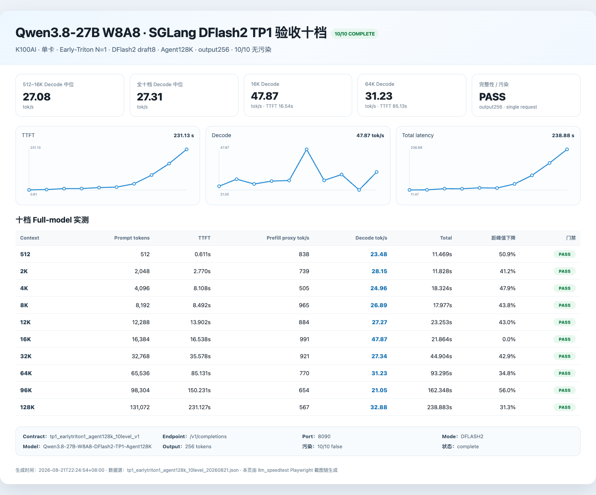

# TP1 Profile：Qwen3.8-27B W8A8 + DFlash2 on K100AI

> **定位：单张 K100AI / Agent128K / 长上下文优先**
> 状态：**ACCEPTED**（2026-08-21）

> ⚠️ 本 Profile 依赖宿主机已经正常工作的 K100AI 驱动、DTK/hyhal 和 Docker GPU 环境。本项目不安装或替换宿主机驱动。当前文档先公开正式验收结果与技术边界；公共部署包正在做最后冻结，不建议把 TP4 根目录脚本直接改成 TP1 参数硬跑。

## 1. Profile 目标

TP1 的目标不是用一张卡去追 TP4 的绝对吞吐，而是在只占用 **1× K100AI** 的前提下，提供一个可长期运行、能够覆盖 64K–128K Agent 上下文的 Qwen3.8-27B W8A8 + DFlash2 服务。

正式验收范围：

- Target：Qwen3.8-27B SmoothQuant W8A8 INT8；
- Draft：Qwen3.8-27B DFlash2；
- TP=1；
- context length = **147456**；
- KV cache = BF16；
- page size = 64；
- chunked prefill = 8192；
- max prefill tokens = 16384；
- Radix Cache = enabled；
- CUDA Graph bs=1；
- speculative draft tokens = 8；
- max running requests = 1。

这个 Profile 明确以 **Agent128K** 为边界，不把此前 262144-context 的实验结果混入正式版本。

---

## 2. 核心方案

TP1 继承了整个 K100AI INT8 优化栈里的公共部分：

- Qwen3.8 W8A8 / compressed-tensors compatibility；
- K100AI/gfx928 native INT8 GEMV；
- DFlash2 SGLang backport；
- gfx928 paged-varlen correctness repair；
- q=8 verifier → 2× native q=4 的 q8split fast path；
- Radix Cache / Agent prefix cache；
- 长上下文 chunked prefill 与 paged/varlen 路由。

TP1 正式 acceptance 额外使用 **Early-Triton N=1**：

- DFlash2 q8 verifier 默认继续使用高速 q8split/native CUDA Graph；
- 每个真实请求只有第 1 个 TARGET_VERIFY round；
- 在 full-attention layer **7、15** 使用 corrected Triton；
- 该首轮强制 eager；
- 后续 round 恢复 native q8split CUDA Graph。

这个组合的目的，是在不让长上下文每一轮 verifier 都支付 Triton 高成本的前提下，保留已经验证过的短语义 correctness。

---

## 3. 正式质量验收

| Gate | 结果 |
|---|---|
| Arithmetic20 | **18/20**，与 corrected target-only 历史基线一致 |
| Critical case15 | **303 / expected 303，PASS** |
| 64K thinking needle | **PASS** |
| 128K thinking needle | **PASS** |
| contamination | **0 / PASS** |
| runtime stability | health=200 · OOMKilled=false · RestartCount=0 |

正式 acceptance 结束时，十档全部通过 max_running/max_waiting 污染门禁。

---

## 4. 正式十档性能

测试口径：单请求、`/v1/completions`、output256、固定 canonical prompt corpus、无污染。

| Prompt tokens | TTFT (s) | Decode (tok/s) | Total (s) |
|---:|---:|---:|---:|
| 512 | 0.611 | 23.48 | 11.469 |
| 2,048 | 2.770 | 28.15 | 11.828 |
| 4,096 | 8.108 | 24.96 | 18.324 |
| 8,192 | 8.492 | 26.89 | 17.977 |
| 12,288 | 13.902 | 27.27 | 23.253 |
| 16,384 | 16.538 | **47.87** | 21.864 |
| 32,768 | 35.578 | 27.34 | 44.904 |
| 65,536 | 85.131 | **31.23** | 93.295 |
| 98,304 | 150.231 | 21.05 | 162.348 |
| 131,072 | 231.127 | **32.88** | 238.883 |

- 10/10 complete；
- decode mean ≈ **29.11 tok/s**；
- decode median ≈ **27.31 tok/s**。

### 正式验收截图

机器可读原始证据：

- [十档 benchmark JSON](results/tp1_earlytriton1_agent128k_10level_20260821.json)
- [Arithmetic20 JSON](results/tp1_earlytriton1_arithmetic20_20260821.json)
- [64K thinking needle JSON](results/tp1_earlytriton1_needle_64k_20260821.json)
- [128K thinking needle JSON](results/tp1_earlytriton1_needle_128k_20260821.json)
- [ACCEPTED manifest](results/tp1_earlytriton1_agent128k_ACCEPTED_20260821.json)
- [证据 SHA256](results/TP1_ACCEPTANCE_SHA256.txt)

> 512–12K 会支付一次 corrected-Triton 的固定首轮成本，因此不是这个 Profile 的主要优化目标。该版本优先保证 64K/128K Agent correctness 与长期运行稳定性。

---

## 5. 和 TP4 怎么选

如果你只有一张空闲 K100AI，或者希望把 GPU 留给其他任务，TP1 是合理选择。

如果你有 4 张卡并且主要跑 32K–128K Agent 工作负载，TP4 的 TTFT 与 decode 都明显更强：

| Context | TP1 TTFT | TP1 Decode | TP4 TTFT | TP4 Decode |
|---:|---:|---:|---:|---:|
| 16K | 16.54s | 47.87 | 4.78s | 108.85 |
| 64K | 85.13s | 31.23 | 24.29s | 66.10 |
| 128K | 231.13s | 32.88 | 63.72s | 68.59 |

TP4 使用 4 倍 GPU，性能更高是预期结果；TP1 的价值在于**单卡可用与 GPU 成本**，不是和 TP4 比绝对冠军速度。

---

## 6. 发布状态

当前正式 acceptance 已完成，**截图、十档、Arithmetic20、64K/128K needle 与 ACCEPTED manifest 已全部公开入库并带 SHA256**。公共部署包还剩最后一层工作：

- 将 TP1 runtime patch 从研究绝对路径整理成可复现 payload；
- 固定公开 Docker build/run 入口；
- 对公开包再跑一次冷启动、quality gate 与十档回归；
- 之后与 TP4 一起维护在本仓库中，而不是另开 GitHub 项目。

完成后首页会直接提供 TP1 的 `build/run` 入口；当前根目录的 Dockerfile/scripts 仍然对应已经完整公开打包验证的 TP4 Stable Profile。

---

返回：[项目首页](README.md) · [TP4 Profile](TP4.md)
